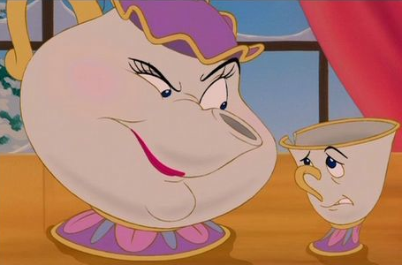

this-is-probably-ok-to-say
----------------

##### AKA tipots




#### TW: this module is meant to filter out problematic language, as such there may be triggering content in the source code and/or dependencies.  `index.js` is safe, but `badSequences`, `customList`, and `sensitiveWords` are probably not good files to read.

TODO: make a tool that lets u add words to these lists without looking at the lists themselves

### ABOUT WORD FILTERING

My main use for this module is twitter bots. I don't want my bots saying bad things, or interacting with users that are saying bad things. There are plenty of words out there and many more to be created, so filtering out vast swaths of them is not really an issue.

Some of the words are just cusses. So yeah, that might filter out awesome tweets like "FUCK CAPITALISM", but it will also mean that my bots never tweet something like "FUCK {group of people}". 

On that note, some of the words are just names for groups of people! For a while I wondered whether in the course of trying to avoid saying messed up stuff I was effectively erasing these groups from the world of my bots. 


### INSTALL

`npm install this-is-probably-ok-to-say --save`

### USE

```
var tipots = require('this-is-probably-ok-to-say')
tipots('oh wow hi this is how you use the tipots module')
=> true // this string does not seem to contain problematic language!
```

### INFO

this module is a wrapper around [iscool](http://github.com/jimkang/iscool) which is itself a wrapper around [wordfilter](https://github.com/dariusk/wordfilter) so in turn I hope that you will write a wrapper around tipots.

in addition to running iscool/worfilter on a string, tipots also has an expanded filter list of words to avoid, as well as word sequences that might be ok when broken up but are not cool together (i.e, "electric chair"), while also running sentiment analysis and rejecting any strings that have a very negative score and also mention a sensitive word such as a religion or ethnicity.

### CONTRIBUTING

If in the course of using tipots you find that it lets through a word or string that is not cool, please open an issue or make a PR so we can change that!
This is the file of [bad sequences of words](https://github.com/coleww/this-is-probably-ok-to-say/blob/master/badSequences.js) and this is the file of just [bad words](https://github.com/coleww/this-is-probably-ok-to-say/blob/master/customList.js) though :warning: both of these files are obviously full of problematic language :< Words that are usually ok to tweet about but that might be innapropriate in a very negatively charged tweet can go in [sensitive words](https://github.com/coleww/this-is-probably-ok-to-say/blob/master/sensitiveWords.js)


[](https://nodei.co/npm/this-is-probably-ok-to-say/)


### THANKS FOR ALL THE MODULES


[iscool](http://github.com/jimkang/iscool) 


[wordfilter](https://github.com/dariusk/wordfilter) 


[offensive.py](https://github.com/molly/CyberPrefixer/blob/master/offensive.py) by [Molly White](https://github.com/molly)

